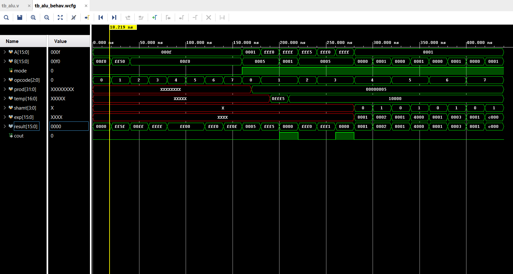

# 16-Bit Multi-Cycle CPU Design

A 16-bit Arithmetic Logic Unit (ALU) implemented in Verilog and simulated using Vivado xsim.  
Designed for a Digital System Design course at the University of Houston–Clear Lake.

## Overview

The ALU operates in two modes selected by a `mode` bit, supporting 8 logic operations, 4 arithmetic operations, and 4 shift/rotate operations on 16-bit operands.

## Module Hierarchy
  ALU (top)
  ├── logic_unit
  ├── arith_unit
  └── shift_unit
## Operation Table

| mode | opcode | Operation |
|------|--------|-----------|
| 0 | 000 | AND |
| 0 | 001 | OR |
| 0 | 010 | XOR |
| 0 | 011 | NAND |
| 0 | 100 | NOR |
| 0 | 101 | XNOR |
| 0 | 110 | NOT A |
| 0 | 111 | NOT B |
| 1 | 000 | MUL |
| 1 | 001 | ADD |
| 1 | 010 | SUB |
| 1 | 011 | INC |
| 1 | 100 | SLL |
| 1 | 101 | SRL |
| 1 | 110 | ROL |
| 1 | 111 | ROR |

## Files

| File | Description |
|------|-------------|
| `alu.v` | Top-level ALU module |
| `logic_unit.v` | Bitwise logic operations |
| `arith_unit.v` | Arithmetic operations (MUL, ADD, SUB, INC) |
| `shift_unit.v` | Shift and rotate operations |
| `tb_alu.v` | Testbench |

## Tools

- Verilog HDL
- Xilinx Vivado (simulation via xsim)

## Simulation Results

